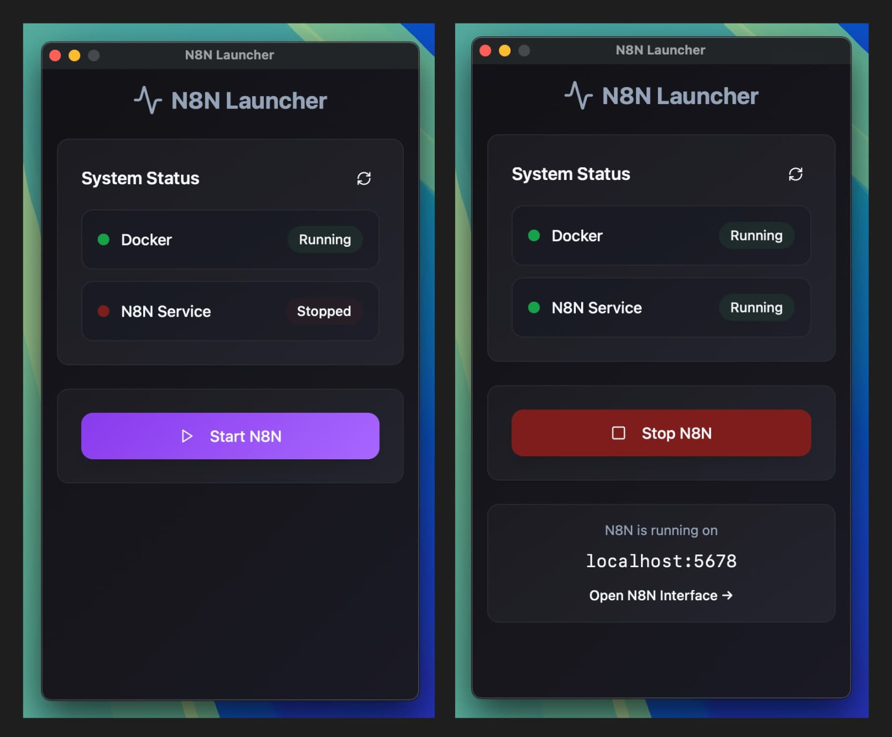

# N8N Launcher

A cross-platform desktop application to easily start your local N8N instance. This launcher provides a user-friendly interface for Docker container lifecycle management, status monitoring, and log viewing for a complete N8N stack.



## 🐳 Prerequisites

**Docker Desktop must be installed and running** on your machine before using N8N Launcher. The application manages N8N through Docker containers.

- **Download Docker Desktop**: [https://www.docker.com/products/docker-desktop](https://www.docker.com/products/docker-desktop)
- **Make sure Docker is running** before launching N8N Launcher

## ⚠️ Important Security Notice

**N8N Launcher is a simple prototype built without official Apple or Microsoft code signing certificates.** This means your operating system will show security warnings when you first run the application.

### 🍎 macOS Installation

1. **Download and open the .dmg file**
2. **Drag N8N Launcher to Applications folder**
3. **When you first run the app**, macOS will show: *"N8N Launcher cannot be opened because it is from an unidentified developer"*
4. **To authorize the app:**
   - Go to **System Preferences** → **Security & Privacy** → **General**
   - You'll see a message about N8N Launcher being blocked
   - Click **"Open Anyway"**
   - Confirm by clicking **"Open"** in the dialog

### 🪟 Windows Installation

1. **Download and run the .msi installer**
2. **Windows may show**: *"Windows protected your PC"* or *"Unknown publisher"*
3. **To authorize the app:**
   - Click **"More info"** on the Windows Defender SmartScreen dialog
   - Click **"Run anyway"**
   - Complete the installation as normal

> **Why this happens:** Since this is a prototype application, I haven't purchased expensive code signing certificates from Apple or Microsoft. The app is completely safe to use - your OS is just being cautious about unsigned applications.

## 📥 Download

Get the latest version of N8N Launcher for your platform:

| Platform | Download |
|----------|----------|
| 🍎 **macOS** | [Download for macOS](https://github.com/juanpujol/n8n-launcher/releases/download/v0.1.3/n8n-launcher_0.1.3_aarch64.dmg) |
| 🪟 **Windows** | [Download for Windows](https://github.com/juanpujol/n8n-launcher/releases/download/v0.1.3/n8n-launcher_0.1.3_x64_en-US.msi) |

> 💡 **Tip**: For the latest releases and all available formats, visit our [Releases page](https://github.com/juanpujol/n8n-launcher/releases).

## Features

- 🐳 **Docker Management**: Start/stop N8N stack with PostgreSQL, Redis, and N8N services
- 📊 **Status Monitoring**: Real-time Docker container status checking
- 📝 **Log Viewing**: View N8N container logs directly in the app
- 🖥️ **Cross-Platform**: Supports macOS (Intel/Apple Silicon) and Windows
- 🔒 **Secure**: Restricted shell access with Tauri capabilities
- ⚡ **Fast**: Built with Rust backend and React frontend

## Prerequisites

- **Docker Desktop** must be installed and running
- **Bun** runtime for development

## Installation

### From Releases
Download the latest release for your platform:
- **macOS**: Download the `.dmg` file or `.zip` containing the `.app` bundle
- **Windows**: Download the `.msi` installer or `.exe` portable version

### Development Setup

1. Clone the repository:
```bash
git clone <repository-url>
cd pocket-n8n
```

2. Install dependencies:
```bash
bun install
```

## Development

### Frontend Development
```bash
# Start Vite development server (port 5173)
bun run dev

# Build frontend for production
bun run build

# Preview production build
bun run preview
```

### Tauri Development
```bash
# Start Tauri app in development mode (includes frontend hot reload)
bun run tauri:dev

# Build Tauri app for production/distribution
bun run tauri:build
```

### Platform-Specific Builds
```bash
# Build for macOS Apple Silicon
bun run tauri:build:mac

# Build for macOS Intel
bun run tauri:build:mac-intel

# Cross-compilation to Windows/Linux not supported locally
# Use GitHub Actions workflow for multi-platform builds
```

### Code Formatting
```bash
# Format code with Biome
bun run lint
```

## Architecture

### Tech Stack
- **Frontend**: React 19 + TypeScript + Vite
- **Backend**: Rust + Tauri
- **Styling**: Tailwind CSS + Radix UI components
- **Build**: Tauri bundler for native app packaging

### Docker Stack
The application manages a complete N8N environment with:
- **PostgreSQL 16**: Database with health checks
- **Redis 7**: Queue management with authentication
- **N8N Editor**: Main interface (port 5678)
- **N8N Webhook**: Dedicated webhook processor
- **N8N Worker**: Background job processor

### Security
- Shell access restricted to specific Docker commands via Tauri capabilities
- Ad-hoc code signing enabled for macOS builds
- No direct filesystem access beyond configured permissions

## Usage

1. **Launch the app** - The N8N Launcher will start with a clean interface
2. **Check Docker status** - App verifies Docker is installed and running
3. **Start N8N** - Click to start the complete N8N stack via Docker Compose
4. **Monitor status** - View real-time container status and logs
5. **Access N8N** - Open N8N web interface at `http://localhost:5678`
6. **Stop when done** - Cleanly stop all containers when finished

## Configuration

### Environment Variables
The Docker stack supports customization via environment variables:
- `N8N_PORT`, `N8N_HOST`, `N8N_PROTOCOL` - URL configuration
- `DB_POSTGRESDB_*` - Database credentials
- `QUEUE_BULL_REDIS_PASSWORD` - Redis authentication
- `EXECUTIONS_DATA_MAX_AGE`, `EXECUTIONS_DATA_PRUNE_MAX_COUNT` - Execution limits

### N8N Configuration
- Default port: 5678 (configurable via N8N_PORT)
- Queue-based execution with Redis backing
- PostgreSQL for persistent data storage
- Automatic data pruning (168 hours max age, 1000 execution limit)
- Shared volume for data persistence across container restarts

## Contributing

This project uses:
- **Bun** for package management and running scripts
- **Biome** for code formatting and linting
- **GitHub Actions** for automated builds and releases

## Building Releases

Releases are automated via GitHub Actions. To create a new release:

1. Use the "Cross-Platform Release" workflow in GitHub Actions
2. Choose version bump type (patch/minor/major) or specify custom version
3. Workflow will:
   - Update version in all relevant files
   - Create git tag
   - Build for all platforms
   - Create GitHub release with changelog
   - Upload platform-specific artifacts

## License

This project is licensed under the MIT License - see the [LICENSE](LICENSE) file for details.
